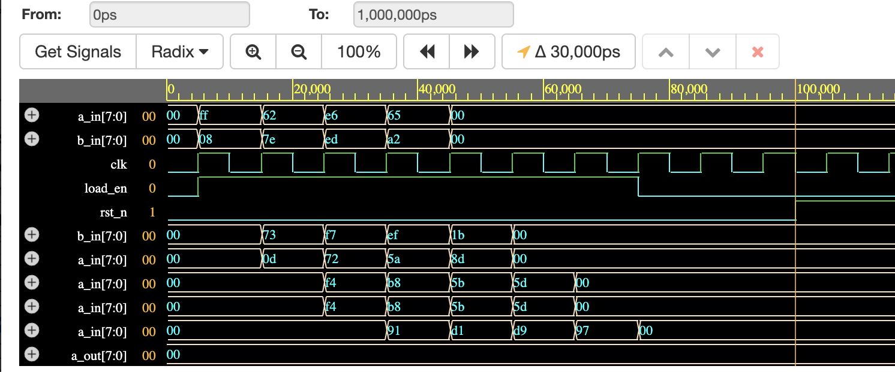

# Systolic Array UVM Verification Environment

This repository contains a comprehensive **UVM (Universal Verification Methodology)** testbench designed to verify a high-performance, parameterizable **NxN Systolic Array**. The design is optimized for matrix multiplication ($C = A \times B$) using signed 2's complement arithmetic.

## 1\. Design Overview

The project consists of two main hardware layers:

  * **`systolic_array.v`**: A weight-stationary PE (Processing Element) mesh[cite: 25, 90]. Each PE performs a multiply-accumulate (MAC) operation: $C_{out} = A \times B + C_{in}$.
  * **`sub_sys.v`**: A sub-system wrapper that integrates input/output FIFOs and a **Data Alignment Unit** to handle skewed data timing required by the systolic architecture.

## 2\. Verification Architecture

The UVM environment is structured to support constrained random testing and automated result checking.

### Key Features:

  * **Signed Logic Support**: Fully verified for 2's complement arithmetic, ensuring accuracy for negative-weight neural network computations[cite: 223].
  * **Data Skewing Driver**: The UVM Driver automatically transforms standard matrices into the "staggered" time-domain inputs required by the hardware[cite: 331, 332].
  * **SVA Protocol Checking**: The interface includes **SystemVerilog Assertions** to verify reset states, data stability, and output latency[cite: 352].
  * **Golden Reference Model**: A matrix-multiplication scoreboard that compares DUT outputs against a mathematical reference queue.

## 3\. Files

### Design Under Test (DUT)

1.  `systolic_array.v` - Core Mesh
2.  `sub_sys.v` - Sub-system with FIFO & CDC logic

### UVM Environment (`systolic_pkg.sv`)

The environment components are neatly organized in a package:

```systemverilog
`include "systolic_if.sv"
`include "systolic_seq_item.sv"
`include "systolic_cfg.sv"
`include "systolic_sequence.sv"
`include "systolic_sequencer.sv"
`include "systolic_driver.sv"
`include "systolic_monitor.sv"
`include "systolic_scoreboard.sv"
`include "systolic_agent.sv"
`include "systolic_env.sv"
```

## 4\. Final Result

The following waveform demonstrates consecutive matrix multiplications. Note the staggered (skewed) input of matrix $A$ and the corresponding parallel output of matrix $C$ once the pipeline is full.


## 5\. Revision History

| Version | Description |
| :--- | :--- |
| **0.1** | Initial push, added systolic UVM components to repo |
| **0.2** | Connected `systolic_array` DUT with testbench |
| **0.3** | Removed checker for no-DUT testcases |
| **0.4** | **Current**: Integrated Signed Logic, Data Skewing Driver, and SVA Protocol Checkers |

